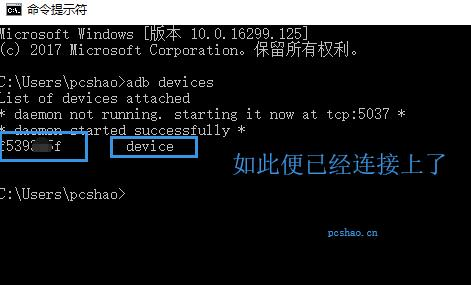

<!doctype html>
<html>
<head>
<meta charset="utf-8">
<title>wechat_jump2jump帮助文档</title>
<!--[if lt IE 9]>

<![endif]--></head>
<body>

  <header>
    
  </header>
  

    <ul class="nav">
        <li><a href="http://www.oracle.com/technetwork/java/javase/downloads/jdk9-downloads-3848520.html">jdk下载</a></li>
        <li><a href="http://dl.adbdriver.com/upload/adbdriver.zip">ADB驱动下载</a></li>
        <li><a href="https://github.com/pcshao/wechat_jump2jump">源码</a></li>
    </ul>
    <aside>
    
JAVA

    </aside>
  <!-- end .sidebar1 -->

  <article class="content">
    <h1>wechat_jump2jump 微信跳一跳辅助</h1>
    <section>
     <h2>实现原理</h2>
      
1.获得游戏界面截图（adb驱动）

      
2.游戏截图在pc端进行图像识别，找出自身点和下一跳的点

      
3.两点算出距离，乘以一定的系数得出一个模拟点击的数值（adb驱动）

    </section>
    <section>
      <h2>步骤</h2>
      
1.下载安装<a href="https://jingyan.baidu.com/article/7f41ecec349c0f593d095c84.html">ADB驱动</a>，将安装目录设置简单点，如D:/adb

      
ADB

就是什么是adb。Android Debug Bridge

Android操作系统与桌面电脑间沟通的一个命令列工具。
可以在电脑上通过命令达到操作手机的效果。

2.测试是否连接上

手机打开开发者，USb调试(部分手机，如miui还要打开模拟点击），用数据线连接到电脑上，如果手机界面显示USB授权，请点击确认。

在cmd输入

adb devices

3.下载源码

<a href="https://github.com/pcshao/wechat_jump2jump">https://github.com/pcshao/wechat_jump2jump</a>

4.执行cn/pcshao/xgames/wechat_jump2jump/control/jump.java执行主方法

&nbsp;

&nbsp;

    </section>
    
  <!-- end .content --></article>
  <aside>
    <h4>需要</h4>
    
jdk1.8

    
adb驱动

    
IDE

  </aside>
  <footer>
   
  </footer>
  <!-- end .container -->

</body>
</html>
